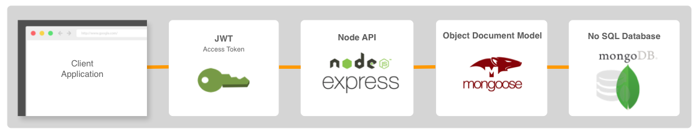

# RESTful API Template

## Summary

This is a template repository for starting a new RESTful API using GitHub's ['Create a repository from a template'](https://help.github.com/en/github/creating-cloning-and-archiving-repositories/creating-a-repository-from-a-template) workflow. This API uses the following technology stack:

*  The authentication strategy uses [JSON Web Token](https://www.npmjs.com/package/jsonwebtoken) (JWT).
* The API is implemented using [Express](https://expressjs.com).
* [Mongoose](https://mongoosejs.com) is used as the Object document model (ODM) when interfacing with the database.
* [MongoDB](https://www.mongodb.com) is the NoSQL database.
* Unit and Integration Testing
  * [Jest](https://jestjs.io) - JavaScrip testing library.
  * [Supertest](https://github.com/visionmedia/supertest) - provides testing utilites for RESTful APIs.
  
## Features

* After clonging this repo, environments can be configured to connect to either a local or remote MongoDB instance.
* Auth middleware is implemented to support authenticating REST endpoints.
* A user resource is implemented and supports the following general requirements:

|  HTTP Verb | Resource  | General Description  |     
|---|---|---|
|  POST | /user  | Registers a new user.  |   
|  POST | /user/login  |  Logs in a user, returns a JWT on success.  A user can create a collection of tokens for multi-device support. |      
|  POST | /user/logout |  Logs out the user. | 
|  POST | /user/logoutAll | Logs out user from all devices. |
|  GET  | /user/me | Returns information about the authenticated user. |
|  PATCH| /user/me | Updates information for the authenticated user. |
|  DELETE | /user/me | Deletes the authenticated user. |    

* Testing libraries/utilities are configured to support unit and integration tests. Test coverage is implemented for the /user endpoints.
* Ability to add project-specific REST enspoints for your project.

## Using this Template

TBD

## Directory Structure

TBD